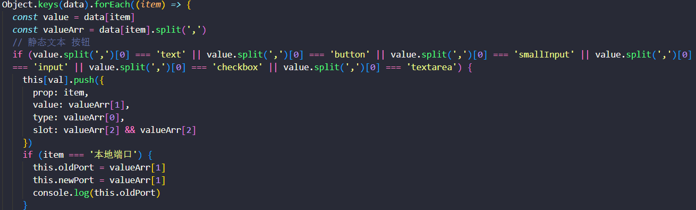

# 物联IOT网关系统

网关管理后台，基于Vue2、nodejs开发。通过nodejs的fs模块，读取和写入配置文件(见下图读取配置文件，ini,config,tmp文件)。可提供修改配置文件的类型(第一个参数)，动态修改页面显示的类型、和动态增添页面显示表单的行数

1.项目：此项目master分支项目，没有封装组件（可读性高，但是相同的组件比较多），也需要跑node的后端代码，见第三点

只需要使用vue自定义框架模板的，也可以直接删除相关的读取ini文件代码，也可直接拉取initial初始分支

优化（封装组件）的项目在develop分支！！！

2.注意：此项目所需的配置文件(config tmp usr)，需要移动到该项目的根目录下，见下图（config/xxx.ini文件）

3.开发步骤：

- 进入/src/node把后端fs请求项目跑起来，操作如下

  node .\getIni.js

- 进入项目启动前端起来，操作如下：

```
    npm run serve
```

4.框架样式：不使用UI框架（需要UI框架的可直行修改组件样式），直接vue2组件写样式。

5.提供统一进行axios请求管理

6.Mixin封装类似的逻辑（见下图mixin文件，读取配置文件数据，响应式动态渲染页面）；

7.配置文件的配置，采用类型区分（见下图ini文件，通过多项值逗号隔开，第一项为类型，修改类型页面动态改变样式）

8.封装动态显示页面组件类型的组件（见下图component文件，通过封装可复用的组件复用）

9.登录提供md5加密存储，和读取账户修改密码(见下图login.ini文件)

ini文件


mixin文件



component文件


读取配置文件


类型判断，写入配置文件


login.ini


/config/xxx.ini


##### login.ini页面逻辑

登录页面的时候，只需要MD5校验，不需要用到密码

##### password页面逻辑

修改密码的时候，通过登录的账号获取对应的密码

##### 其他config配置页面

[xx]：表示页面的标题

其他内容表示：可动态修改页面显示表单

#input表示输入框，第二个表示值，第三个表示备注(不备注可用逗号隔开)

xxxx=input,115200,(600-921600)bps 


#select表示下拉框，第二个表示选中值，第三个到最后第二个表示下拉框的可选选项，最后1个表示备注(不备注可用逗号隔开)

xxxx=select,8,6,8,bit 


#text表示固定值文本，第二个参数表示文本，第三个表示备注(不备注可用逗号隔开)

当前串口模式=text,RS485,


#input表示小输入框，第二个表示值，第三个表示备注(不备注可用逗号隔开)

本地端口=smallInput,1030,(1~65535)


#button表示按钮，第二个表示值(这里用exce来启动.sh文件)，第三个表示备注(不备注可用逗号隔开)

保存及应用=button,/usr/local/bin/uart1save.sh,


其他的单选radio，复选框checkbox，文本域textarea也是类似，已经在封装好组件。修改类型即可使用